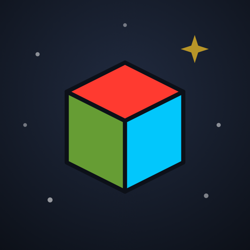
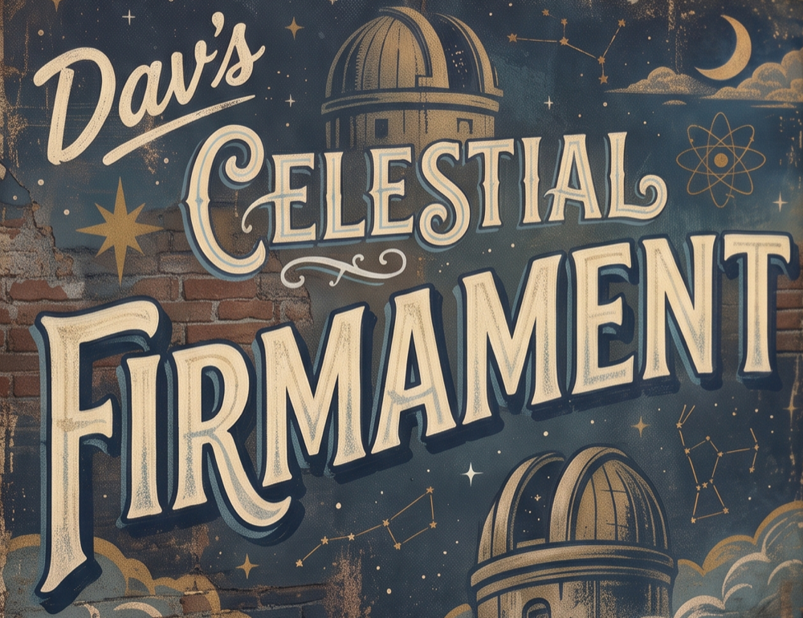
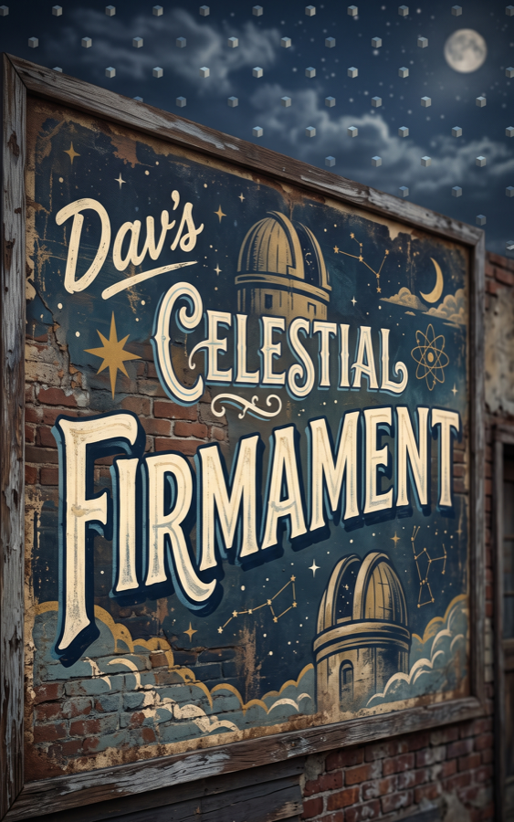

<div align="center">



# Dav's Celestial Firmament



**An iPhone augmented-reality app that lets you *watch* the Earth move through the solar system.**

[](https://apps.apple.com/us/app/davs-celestial-firmament/id6790281555)


</div>

---

## What is it?

Imagine the solar system threaded with an enormous, perfectly regular 3D lattice of markers — centered on the Sun and fixed relative to the distant stars. The lattice never moves. **You do.** Earth spins once a day and races along its orbit at about 30 km/s, so the grid is constantly sweeping past you.

Firmament computes which lattice nodes are above your horizon *right now* — from your GPS position and the current time, against a solar ephemeris accurate to about an arcminute — and draws them over your camera's live view of the sky, exactly where they are. For the first time, you can hold up your phone and see the motion happen.

## Three layouts, one idea

| | |
|---|---|
| **Grid** | Threads space with a regular lattice of colored cubes. Each cube is axis-aligned to the ecliptic; its six faces point at the equinoxes, the solstices, and the ecliptic poles. |
| **Tube** | Floats Earth inside a wide, ring-lined bore following its orbit around the Sun, distant rings receding fore and aft. You drift toward and away from the orbital tube through the day as the Earth turns. |
| **Ride** | Threads that same tunnel through *you* as the center — rings arching overhead just tens of kilometers up, Earth's motion carrying you through them. |

A **narrated intro tour** explains it all on first launch: a 3Blue1Brown-style animated sequence that starts with a race car losing its visual reference points, reveals Earth doing the same thing on its orbit, lays the lattice over the orbital path, then zooms into your own GPS coordinates and melds seamlessly into the live AR view. A picture-in-picture **orrery** keeps you oriented, showing Earth from afar moving through the very nodes hanging in your sky.

<div align="center">

</div>

## The science

- **Solar ephemeris** accurate to ~1 arcminute converts your position and the current instant into a heliocentric observer state.
- **Geodesy** turns GPS latitude/longitude/altitude into an Earth-centered position, then into your local horizon frame.
- Nodes below the horizon are hidden behind the Earth itself (toggleable occlusion). Cube size shrinks with true distance, so small cubes really are farther away, and cubes brighten toward the Sun.
- The math is far more precise than the phone's magnetometer — the limiting factor is compass calibration, not the model.

## Architecture

The astronomy and geometry live in **`FirmamentCore`**, a pure, platform-agnostic Swift package with no UI or RealityKit dependencies — which makes the hard parts unit-testable in isolation.

```
FirmamentCore/            Pure Swift package — the math, fully unit-tested
  Astronomy.swift           Solar ephemeris
  Geodesy.swift             GPS → Earth-centered → local horizon frames
  Frames.swift              Reference-frame transforms
  Lattice.swift             The node lattice + which nodes are visible
  OrbitTube.swift           Tube / Ride orbital geometry
  ObserverState.swift       Heliocentric observer snapshot

App/                      SwiftUI + RealityKit AR client
  SkyRenderer*.swift        Live AR scene: node/edge/sun entity pool
  ContentView / *Bar / HUD  Chrome over the camera feed
  Intro/                    First-launch narrated tour + tour→AR "meld"
    Timeline/                 Declarative, sample-at-time tour model (pure)
    Scene/                    Procedural RealityKit tour scene
    MeldCoordinator.swift     Seamless hand-off from tour to live AR
  Orrery/                   Picture-in-picture orrery
  Logging/                  DEBUG-only diagnostic logging (LogRoller)

Resources/                Asset catalog, Earth texture, intro narration audio
html/                     Marketing / support / privacy-policy site
```

The intro tour's timeline is a **pure function of time** — camera pose, per-entity animation values, and captions are all sampled from a declarative script, so the whole sequence is scrubbable and the choreography lives in one editable file (`App/Intro/IntroScript.swift`).

## Building

The Xcode project is generated with [XcodeGen](https://github.com/yonaskolb/XcodeGen), so `project.yml` is the source of truth — edit it, not the `.xcodeproj`.

```bash
brew install xcodegen        # if needed
xcodegen generate            # regenerate Firmament.xcodeproj
open Firmament.xcodeproj
```

Requirements: **Xcode 26+**, **iOS 26** device with a camera and GPS. The core AR experience needs real hardware (camera + magnetometer + GPS), so it does not run in the Simulator.

Common tasks are wrapped in the `Makefile`:

```bash
make archive            # bump build number, regenerate, archive for the App Store
make deploy-html-only   # publish the html/ marketing site
make local-html-server  # preview the site locally
```

Run the tests from Xcode, or the pure-math suite directly:

```bash
swift test --package-path FirmamentCore
```

## Privacy

Firmament collects nothing. Your GPS position and camera feed are used only on-device to render the sky and never leave the phone — the release app makes **zero** network requests. See the [privacy policy](html/privacy-policy.html).

## Links

- **App Store:** https://apps.apple.com/us/app/davs-celestial-firmament/id6790281555
- **Support & contact:** https://www.akuaku.org/firmament/
- **Privacy policy:** https://www.akuaku.org/firmament/privacy-policy.html

---

<div align="center">
<sub>© 2026 Dav. Source published for reference; not licensed for redistribution.</sub>
</div>
